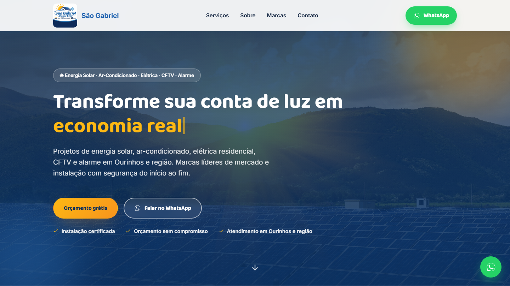

# São Gabriel Energia Solar

Landing page institucional para a São Gabriel Energia Solar, empresa de Ourinhos-SP especializada em energia solar fotovoltaica, ar-condicionado, elétrica residencial, CFTV e alarme.

**Site no ar:** https://sao-gabriel-energia-solar.vercel.app



## Sobre o projeto

Página única (one-page), construída em HTML, CSS e JavaScript puros, sem framework e sem etapa de build. Foco em performance, identidade visual da marca (azul royal, azul-marinho e amarelo/laranja solar) e uma experiência de rolagem com efeitos de destaque.

### Seções

- Header fixo com logo, navegação e CTA de WhatsApp
- Hero em tela cheia com headline em efeito de digitação
- Faixa de marcas parceiras (LG, Fujitsu, Elgin, TCL, Intelbras) em cards de vidro líquido
- Cards de serviços com fotos reais
- Bloco "por que economia solar" com calculadora de economia estimada
- Faixa de impacto com foto de usina solar e efeito parallax
- Como funciona (processo em 4 passos)
- Galeria de trabalhos e equipamentos
- FAQ em acordeão
- CTA final e rodapé com contato, área de atendimento e contador de visitas ao vivo
- Botão flutuante de WhatsApp fixo
- Página de [Política de Privacidade](privacidade.html) (LGPD)

### Destaques técnicos

- **Animações de scroll com [GSAP](https://gsap.com/) + ScrollTrigger**: barra de progresso de leitura, parallax no hero e na faixa de impacto, entrada em stagger dos cards, respeitando `prefers-reduced-motion`.
- **Performance**: animações limitadas a `transform`/`opacity` (GPU), `loading="lazy"` nas imagens abaixo da dobra, `ScrollTrigger.refresh()` com debounce no resize.
- **Mobile-first e responsivo**: testado de 360px a 2560px de largura, com menu mobile em efeito de vidro (`backdrop-filter`).
- **Acessibilidade**: `aria-expanded`/`aria-controls` no acordeão de FAQ, link "pular para o conteúdo", anel de foco visível em todos os elementos interativos, contraste WCAG AA nos textos sobre imagem e no rodapé.
- **Compartilhamento**: metatags Open Graph e Twitter Card com imagem de pré-visualização própria (`images/og-image.png`) para quando o link é enviado no WhatsApp ou redes sociais.
- **Contador de visitas**: atualização em tempo real no rodapé via polling, discreto e nas cores da marca.

## Stack

- HTML5 semântico
- CSS3 (variáveis customizadas, grid, flexbox, clip-path)
- JavaScript ES6+ (vanilla)
- [GSAP](https://gsap.com/) + ScrollTrigger via CDN
- Fontes: [Baloo 2](https://fonts.google.com/specimen/Baloo+2) e [Inter](https://fonts.google.com/specimen/Inter) via Google Fonts

## Estrutura

```
.
├── index.html
├── privacidade.html
├── css/
│   └── style.css
├── js/
│   └── script.js
├── images/
└── docs/
    └── preview.png
```

## Rodando localmente

Não há dependências nem build. Basta servir a pasta com qualquer servidor estático:

```bash
npx serve .
# ou
python -m http.server 8080
```

Depois acesse `http://localhost:PORTA/index.html`.

## Deploy

O projeto está hospedado na [Vercel](https://vercel.com/) como site estático, sem configuração de build necessária.

## Licença

Distribuído sob a licença MIT. Veja [LICENSE](LICENSE) para mais detalhes.

---

Criado por [Lucas Labs](https://lucaslabs.netlify.app/)
